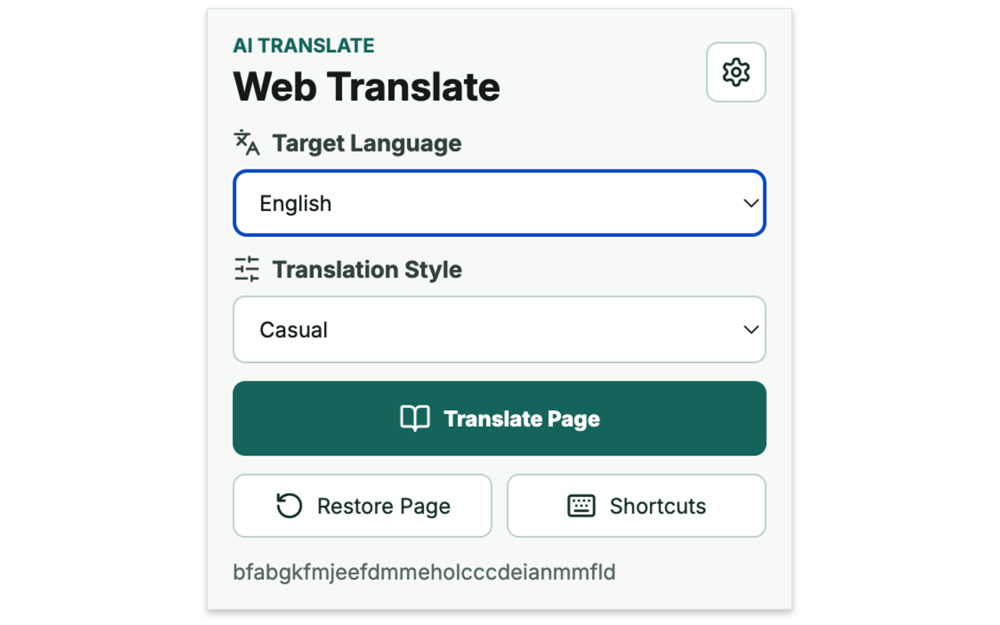
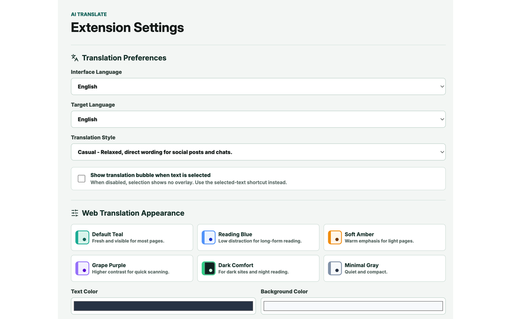
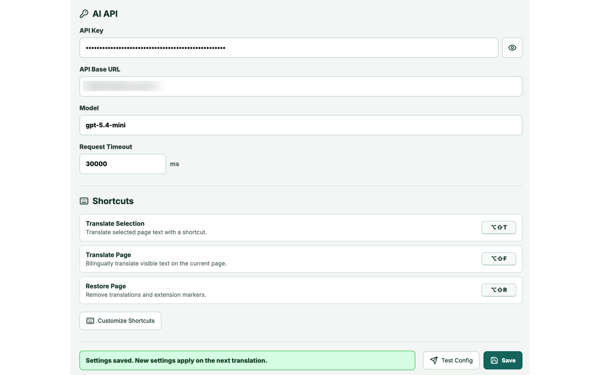
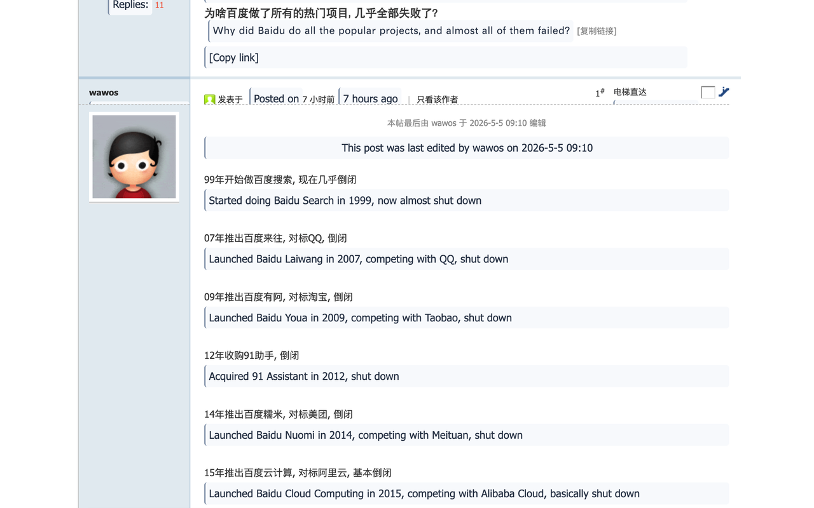

# AI Translate Assistant

AI Translate Assistant is a Chrome / Chromium Manifest V3 extension for selected-text translation, full-page bilingual translation, and one-click page restoration. It works with OpenAI-compatible chat completion APIs and keeps user settings in local browser storage.

[English](#english) | [简体中文](#简体中文)

## Screenshots

| Popup | Translation preferences |
| --- | --- |
|  |  |

| API and shortcuts | Bilingual page translation |
| --- | --- |
|  |  |

## English

### Features

- Selected-text translation with a lightweight floating bubble.
- Full-page translation that injects translations next to the original text.
- Bilingual reading mode that keeps the original page structure intact.
- One-click restore to remove injected translations and return to the original page.
- Configurable target language, interface language, translation style, API base URL, model, request timeout, and page translation appearance.
- OpenAI-compatible API support through `{apiBaseUrl}/chat/completions`; HTTPS is required.
- Internationalized UI for Simplified Chinese, Traditional Chinese, English, Japanese, Korean, French, German, Spanish, Italian, Portuguese, and Russian.
- Chromium compatibility helpers for Chrome, Edge, Brave, Vivaldi, Opera, and other Chromium-based browsers.
- Browser command shortcuts plus content-script fallback shortcuts for browsers that do not reliably trigger the extension command API.

### Install From Source

```bash
npm ci
npm run build
```

Then open your browser extension management page, enable developer mode, and load the generated `dist` directory as an unpacked extension.

Common extension pages:

- Chrome: `chrome://extensions`
- Edge: `edge://extensions`
- Brave: `brave://extensions`
- Opera: `opera://extensions`

### Build A Web Store Package

```bash
npm run package:webstore
```

The Web Store package is generated at:

```text
release/ai-translate-assistant-0.1.2-webstore.zip
```

Generated release files, private keys, CRX files, and build output are intentionally ignored by Git.

### Shortcuts

Default browser command shortcuts:

- `Alt+Shift+T`: translate selected text
- `Alt+Shift+F`: translate the current page
- `Alt+Shift+R`: restore the original page

You can customize browser command shortcuts from your browser's extension shortcuts page, such as `chrome://extensions/shortcuts`.

### Privacy

- API keys are stored only in `chrome.storage.local`.
- API keys are not written to page DOM, injected translation nodes, or extension logs.
- Translation requests are sent only to the API base URL configured by the user.
- The API base URL must use HTTPS.

### License

This project is licensed under the [Apache License 2.0](LICENSE).

## 简体中文

AI Translate Assistant 是一个 Chrome / Chromium Manifest V3 AI 翻译扩展，支持划词翻译、全网页双语翻译和一键恢复原网页。它兼容 OpenAI 风格的 Chat Completions 接口，并将用户配置保存在浏览器本地存储中。

### 功能

- 划词翻译：选中文字后弹出轻量翻译气泡。
- 全网页翻译：扫描当前页面文本，并在原文旁注入译文。
- 双语对照：保留原网页结构，适合阅读长网页。
- 一键恢复：清理插件注入的译文、样式和包裹节点。
- 可配置目标语言、界面语言、翻译风格、API 地址、模型、请求超时和网页译文样式。
- 支持 OpenAI-compatible 接口，请求地址为 `{apiBaseUrl}/chat/completions`，接口地址必须使用 HTTPS。
- 界面支持简体中文、繁體中文、English、日本語、한국어、Français、Deutsch、Español、Italiano、Português、Русский。
- 兼容 Chrome、Edge、Brave、Vivaldi、Opera 等 Chromium 浏览器。
- 支持浏览器命令快捷键，并为部分 Chromium 浏览器提供 content-script 兜底快捷键。

### 从源码安装

```bash
npm ci
npm run build
```

然后打开浏览器扩展管理页，开启开发者模式，选择生成的 `dist` 目录加载已解压的扩展程序。

常见扩展管理页：

- Chrome：`chrome://extensions`
- Edge：`edge://extensions`
- Brave：`brave://extensions`
- Opera：`opera://extensions`

### 生成上架包

```bash
npm run package:webstore
```

生成的 Web Store ZIP 位于：

```text
release/ai-translate-assistant-0.1.2-webstore.zip
```

构建产物、Release 文件、私钥和 CRX 文件已被 Git 忽略，不会提交到仓库。

### 快捷键

默认浏览器命令快捷键：

- `Alt+Shift+T`：翻译选中文本
- `Alt+Shift+F`：翻译当前网页
- `Alt+Shift+R`：恢复原网页

加载扩展后可在浏览器扩展快捷键页面修改命令快捷键，例如 `chrome://extensions/shortcuts`。

### 隐私

- API Key 仅保存在 `chrome.storage.local`。
- API Key 不会写入页面 DOM、注入的译文节点或扩展日志。
- 翻译请求只会发送到用户配置的 API 地址。
- API 地址必须使用 HTTPS。

### 开源协议

本项目使用 [Apache License 2.0](LICENSE) 开源。
